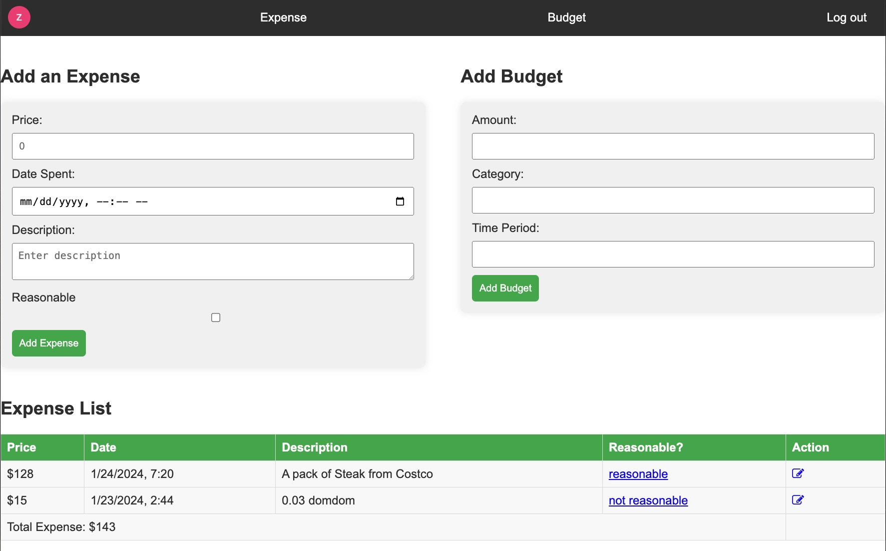

# Expense Tracker
****
## Screenshot

****
### Description
Expense Tracker is an Web application that helps users track their expenses, manage budgets, and gain insights into their spending habits. This app provides a user-friendly interface for adding, editing, and viewing expenses and budgets.
****
### Getting Started
- [Link to Deployed App](https://expense-tracker-sk1.fly.dev)
- [Trello Board](https://trello.com/b/oyWOqIX7/expense-tracker)
****
### Attributions
- [MDN](https://developer.mozilla.org/en-US/)
- [Profile Technology Icons](https://marwin1991.github.io/profile-technology-icons/)
- [cssreference.io](https://cssreference.io/)
- [css-tricks](https://css-tricks.com/)
****
### Technologies Used

	<code></code>
	<code></code>
	<code></code>
	<code></code>
	<code></code>
	<code></code>
	<code></code>
	<code></code>
	<code></code>
	<code></code>

****
❄️ ****ICE Box:****

<input type="checkbox" checked> **User Authentication** - Implement a secure user authentication system to enable user account creation and login.

<input type="checkbox" checked> **Expense Management** - Allow users to add, edit, and delete expense entries with details such as amount, date, and description.

<input type="checkbox" unchecked> **Expense Categorization** - Enhance expense organization by implementing expense categorization (e.g., food, transportation, utilities).

<input type="checkbox" checked> **Expense Listing** - Provide users with a clear list of all expenses for better visibility.

<input type="checkbox" unchecked> **Expense Sorting** - Implement sorting options for expenses based on different criteria for enhanced user experience.

<input type="checkbox" checked> **Budget Management** - Allow users to add and delete budget entries with essential details, including amount, date, and category.

<input type="checkbox" checked> **Enhanced Styling** - Improve the user interface with a more polished and user-friendly design.

